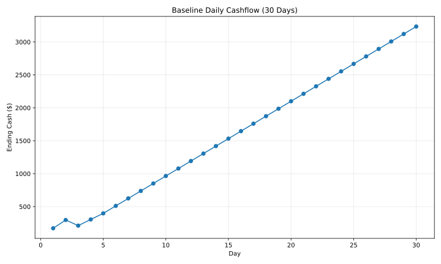
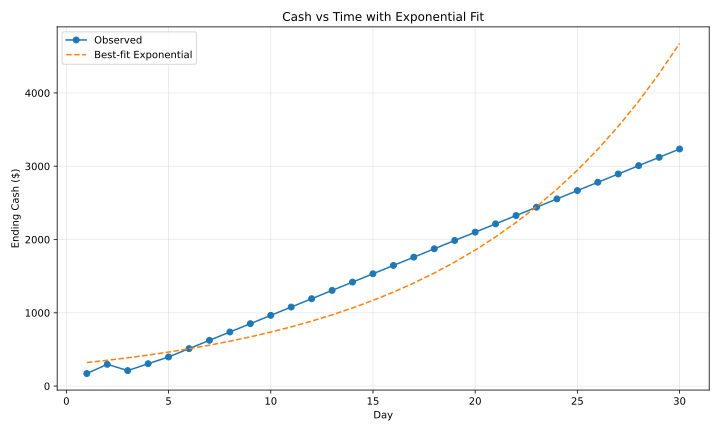
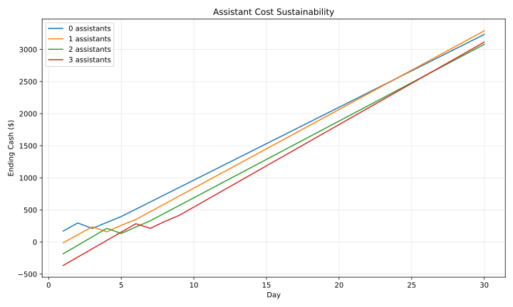
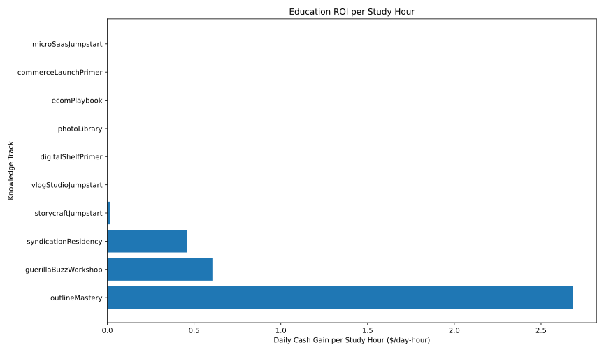

# Economy Simulation Report

## Methodology
- Source data: `docs/normalized_economy.json` converted into deterministic simulations via `scripts/economy_simulations.py`.
- Baseline scenario assumptions:
  - Initial state uses starting cash `$45` and `14` available hours per day.
  - Daily activity prioritizes Freelance Writing, using any sub-hour remainder on Micro Survey Dash (max 4/day).
  - One Personal Blog Network is funded as soon as cash allows; setup consumes `3h` for three days, and maintenance requires `0.6h` plus `$3` per day.
  - Asset income uses the midpoint of the quality 0 payout band.
- Assistant scenarios hire assistants on day 1 and immediately pay hiring costs plus ongoing wages ($24/day each) while unlocking +3 hours/day.
- Education ROI is calculated from baseline activity levels, translating each track’s modifiers into additional expected daily income once the course completes.

All figures cover a 30-day horizon with deterministic averages (no variance sampling).

## Daily Cashflow (30-day Baseline)

Key notes:
- Days 1–2 devote all 14 hours to Freelance Writing, generating `$126` per day and growing cash to `$297` before any investments.
- Beginning on day 3, 3 hours/day redirect to blog construction, lowering daily cash gain to `$94` and showing the opportunity cost of asset setup.
- After the blog activates on day 5, the steady-state day delivers `$112` from hustles plus `$4.50` from the blog while spending `$3` on upkeep, producing a net `$113.5`/day trend through day 30.

## Cash vs Time: Exponential Fit Check

- The best-fit exponential curve implies ~9.2% compound growth per day, yet the observed curve is near-linear beyond day 6.
- Divergence widens as the exponential projection overshoots: by day 30, the exponential estimate is ~`$3.7k` versus the observed `$3.2k`, indicating insufficient compounding mechanics under the baseline policy.
- Bottleneck: hours remain fixed at 14/day, so additional cash cannot be reinvested into higher-yield actions without new systems.

## Assistant Cost Sustainability

- Hiring immediately pushes the balance negative (`-$11` with 1 assistant, `-$365` with 3) because hire costs exceed the starting bankroll.
- Once the upfront deficit is cleared, additional hours allow more Freelance Writing, and long-run daily gains surpass wages; three assistants stabilize at ~`$120` net/day versus `$106` baseline.
- The early red zone highlights design friction: assistants require either credit access, staged hiring, or lower upfront cost to avoid soft-locking players.

## Education ROI per Study Hour

Highlights (top 10 tracks by ROI per study hour):
- **Outline Mastery** offers `$2.69` of daily cash per study hour once complete, recouping its `$140` tuition in ~5.2 days thanks to the +25% Freelance Writing bonus.
- **Guerilla Buzz Workshop** delivers `$0.61`/hour mainly via the +$1.50 Micro Survey bump, but the long payback (~33 days) and opportunity cost limit appeal.
- Most other tracks provide negligible ROI in the baseline because their bonuses target assets/hustles not yet unlocked, underscoring pacing gaps.

## Divergence from Intended Growth Pacing
- **Hour scarcity**: Cash growth remains linear because time, not money, is the limiting factor after day 5. Without new time sinks or automation, compounding never materializes.
- **Assistant onboarding friction**: Assistants eventually improve net income but create steep early deficits. Intended support role becomes a debt trap unless players already snowball cash.
- **Education gating**: Only Outline Mastery synergizes with the starting loop; other courses read as “dead investments” during the first month, delaying education’s intended strategic impact.

## Recommendations
1. Introduce low-cost, low-hour reinvestments (e.g., quick upgrades) so surplus cash can accelerate growth without additional time slots.
2. Spread assistant hiring cost or add financing so the support system is accessible before players stockpile several days of profit.
3. Stage early-track bonuses (or temporary boosts) that interact with the first hustle loop to demonstrate education value sooner.
